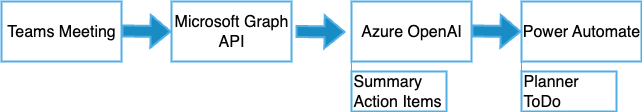

# M365 Copilot Agent – Meeting Summary & Action Item Automation
## Project Overview
This repository contains a sample design and prototype of a Microsoft 365 Copilot Agent for enterprise productivity in the Japanese market. 
The agent assists in automating meeting summarization and action item tracking by leveraging Azure OpenAI Service, Microsoft Graph API, and Power Platform connectors.

## Background
Meetings in Japan tend to be lengthy and creating meeting minutes and tracking tasks is often manual. This project demonstrates how Microsoft 365 Copilot can automate the entire workflow:
Meeting -> Summary Generation -> Task Creation

## Architecture Diagram

## Flow
- Fetch Teams meeting transcripts via Microsoft GraphAPI
- Generate summary and action items using Azure OpenAI GPT-5
- Automatically registter tasks to Planner using Power Automate

## Technical Stack
- Microsoft Graph API - Get meeting transcripts
- Azure OpenAI Service - Generate summaries and action items
- Power Automate - Task creation
-  Python - Data processing scripts

## Sample Code
### Fetch meeting notes (Graph API)
from scripts.fetch_meeting_notes import fetch_meeting_transcript
print(fetch_meeting_transcript())

### Generate summary (Azure OpenAI)
from scripts.summarize_action_items import summarize
transcript = "Today we finalized the launch schedule for the new product..."
print(summarize(transcript))

## Setup
- Create a Microsoft 365 Developer account
- Create an Azure OpenAI resource
- Add your API keys and Meeting ID to the Python scripts in scripts/
- Environment: Python 3.10+

## Use Cases
- Automatically distribute meeting summaries and action items after meetings
- Summarize project meetings and register tasks with due dates
- Provide multilingual summaries for global teams

## Future Improvements
- Internal data integration with SharePoint
- Teams Chat summurization
- Multilingual translation

## プロジェクト概要
本リポジトリは、日本企業向けに設計したMicrosoft 365 Copilot Agentのサンプルプロジェクトです。
Azure OpenAI、Microsoft Graph API、Power Platformを活用し、会議の要約とアクションアイテム管理を自動化します。

## 背景
日本企業では会議が長く、議事録作成やタスク化が属人的になりやすい課題があります。  
本プロジェクトでは、Microsoft 365 Copilot と AI を活用し、**「会議終了 → 要約生成 → タスク登録」**までの流れを自動化します。

## アーキテクチャー

## フロー
1. Teams 会議終了後、Microsoft Graph API で会議の文字起こしデータを取得
2. Azure OpenAI GPT-4 により要約とアクションアイテム抽出
3. Power Automate フローで Planner / To Do に自動登録

## 技術スタック
- Microsoft Graph API – 会議記録取得
- Azure OpenAI Service – 要約＆アクションアイテム生成
- Power Automate – タスク登録
- Python – データ取得・処理スクリプト

## コードサンプル
### 会議記録取得（Graph API）
from scripts.fetch_meeting_notes import fetch_meeting_transcript
print(fetch_meeting_transcript())

### 要約生成（Azure OpenAI
from scripts.summarize_action_items import summarize
transcript = "本日は新製品の発売予定日を決定し..."
print(summarize(transcript))

## セットアップ
- Microsoft 365 Developer アカウントを作成
- Azure OpenAI リソースを作成
- scripts/ 内の Python ファイルに API キーと Meeting ID を設定
- 実行環境: Python 3.10+

## 想定ユースケース
- 定例会議後、議事録とアクションアイテムを自動配信
- プロジェクト会議の内容を要約し、期限付きタスクとして登録
- グローバルチーム向け多言語要約

## 今後の改善案
- 社内データ統合、SharePointとの統合
- Teamsチャット要約機能追加
- 多言語翻訳対応
